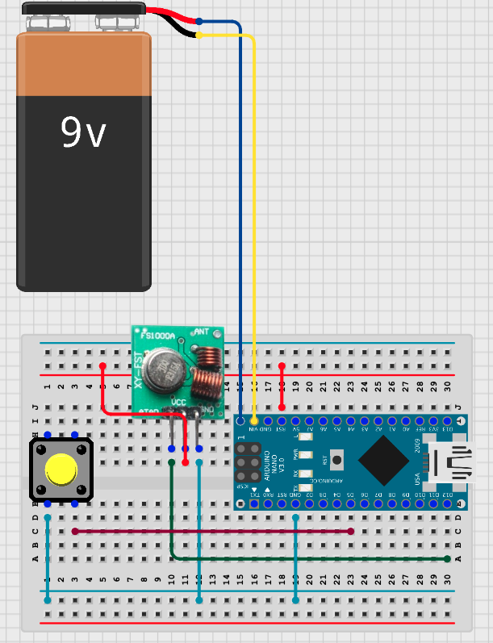
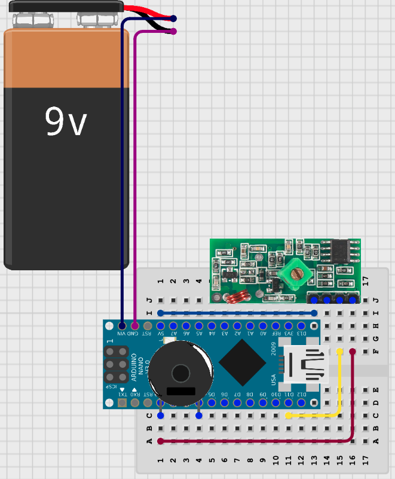

<!DOCTYPE html>
<html lang="en">
<head>
    <meta charset="UTF-8">
    <meta name="viewport" content="width=device-width, initial-scale=1.0">
</head>
<body>

<h1>Arduino Doorbell Project</h1>

This project is a doorbell system using an Arduino. It features a button that, when pressed, sends a signal to play a sound via a speaker.

<h2>Features</h2>
<ul>
    <li><strong>Button Press</strong>: The doorbell is activated by a pushbutton switch.</li>
    <li><strong>Audio Output</strong>: Plays a pre-defined song using a buzzer.</li>
    <li><strong>Wireless Communication</strong>: Uses RF modules for wireless data transmission.</li>
    <li><strong>Low Power Consumption</strong>: The system is powered by batteries in order to work anywhere without direct power supply. Implements power-saving techniques by using idle and power-down modes.</li>
</ul>

<h2>Components Required</h2>
<ul>
    <li>Arduino pro mini 3.7v or compatible board</li>
    <li>433 Mhz RF Transmitter and Receiver Module</li>
    <li>Buzzerr</li>
    <li>Pushbutton switch</li>
    <li>3.7V battery or appropriate power supply</li>
    <li>Jumper wires</li>
    <li>Breadboard</li>
</ul>

<h2>Transmitter Schematic</h2>

Below is the schematic for the transmitter part of the project:

<h2>Receiver Schematic</h2>

Below is the schematic for the receiver part of the project:

</body>
</html>
